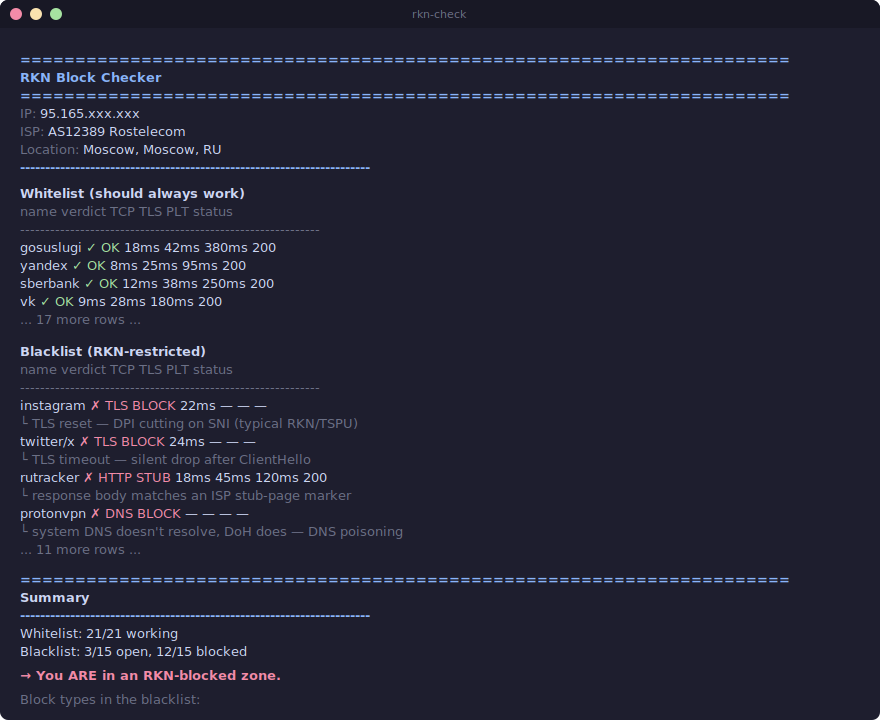

# RKN Block Checker

[](https://pypi.org/project/rkn-block-checker/)[](https://github.com/MayersScott/rkn-block-checker/actions/workflows/ci.yml)
[](https://www.python.org/downloads/)
[](LICENSE)

A small CLI that figures out whether the connection you're sitting on is in an
RKN/TSPU-blocked zone — and, more usefully, **what kind** of block it is
(DNS poisoning, TCP reset, TLS DPI on SNI, or an ISP stub page).

The point isn't "site X doesn't open." Browsers already tell you that. The
point is to look at each layer of the stack independently and report *where*
it broke. That tells you a lot more about your situation than a generic
"this site can't be reached" page.

## Example output



<details>
<summary>Same output as plain text</summary>

```text
======================================================================
  RKN Block Checker
======================================================================
  IP:       95.165.xxx.xxx
  ISP:      AS12389 Rostelecom
  Location: Moscow, Moscow, RU
----------------------------------------------------------------------

Whitelist (should always work)
  name          verdict            TCP     TLS     PLT  status
  ------------------------------------------------------------
  gosuslugi     ✓ OK              18ms    42ms   380ms  200
  yandex        ✓ OK               8ms    25ms    95ms  200
  sberbank      ✓ OK              12ms    38ms   250ms  200
  vk            ✓ OK               9ms    28ms   180ms  200
  ...

Blacklist (RKN-restricted)
  name          verdict            TCP     TLS     PLT  status
  ------------------------------------------------------------
  instagram     ✗ TLS BLOCK       22ms       —       —  —
    └ TLS reset — DPI cutting on SNI (typical RKN/TSPU)
  twitter/x     ✗ TLS BLOCK       24ms       —       —  —
    └ TLS timeout — silent drop after ClientHello
  rutracker     ✗ HTTP STUB       18ms    45ms   120ms  200
    └ response body matches an ISP stub-page marker
  protonvpn     ✗ DNS BLOCK          —       —       —  —
    └ system DNS doesn't resolve, DoH does — DNS poisoning
  ...

======================================================================
  Summary
----------------------------------------------------------------------
  Whitelist: 21/21 working
  Blacklist: 3/15 open, 12/15 blocked

  → You ARE in an RKN-blocked zone.

  Block types in the blacklist:
    ✗ TLS BLOCK: 8
    ✗ DNS BLOCK: 2
    ✗ HTTP STUB: 2
======================================================================
```

</details>

## Install

Python 3.10+.

```bash
pip install rkn-block-checker
rkn-check
```

Or from source:

```bash
git clone https://github.com/MayersScott/rkn-block-checker.git
cd rkn-block-checker
pip install -e .
rkn-check
```

## Run with Docker

Build the image:

```bash
docker build -t rkn-block-checker .
```

Show CLI help:

```bash
docker run --rm rkn-block-checker
```

Run a real check:

```bash
docker run --rm rkn-block-checker --json
```

Use custom target lists from the current directory:

```bash
docker run --rm -v "$PWD:/work" -w /work rkn-block-checker \
  --white-file ./whitelist.txt \
  --black-file ./blacklist.txt
```

With Docker Compose:

```bash
docker compose run --rm rkn-check --json
```

## Usage

```text
rkn-check [-h] [--json] [--white] [--black] [--timeout TIMEOUT]
          [--workers WORKERS] [-v]
```

| flag | what it does |
|------|--------------|
| `--json` | machine-readable JSON instead of the colored report |
| `--white` | only the control (whitelist) targets |
| `--black` | only the blacklist targets |
| `--timeout` | per-probe timeout in seconds (default 5.0) |
| `--workers` | thread pool size for parallel checks (default 10) |
| `-v` / `-vv` | logging at INFO / DEBUG |

## JSON output

`--json` emits one object containing `self_info` (the IP/ISP block from the
header) and the two result lists. Every result is the full per-target probe
trace: which DNS resolver returned what, whether TCP and TLS succeeded with
timings, the HTTP status, the verdict, and human-readable notes.

A trimmed sample (full version: [`docs/sample-output.json`](docs/sample-output.json)):

```json
{
  "self_info": {
    "ip": "95.165.xxx.xxx",
    "city": "Moscow",
    "country": "RU",
    "org": "AS12389 Rostelecom"
  },
  "whitelist": [
    {
      "name": "gosuslugi",
      "url": "https://www.gosuslugi.ru/",
      "verdict": "OK",
      "notes": [],
      "sys_ip": "95.181.182.36",
      "doh_ip": "95.181.182.36",
      "dns_mismatch": false,
      "tcp_ok": true,  "tcp_time_ms": 18.4,
      "tls_ok": true,  "tls_time_ms": 42.1, "tls_cert_cn": "*.gosuslugi.ru",
      "status_code": 200, "plt_ms": 380.7
    }
  ],
  "blacklist": [
    {
      "name": "instagram",
      "url": "https://www.instagram.com/",
      "verdict": "TLS_BLOCK",
      "notes": ["TLS reset — DPI cutting on SNI (typical RKN/TSPU)"],
      "sys_ip": "157.240.20.174", "doh_ip": "157.240.20.174",
      "tcp_ok": true,  "tcp_time_ms": 22.4,
      "tls_ok": false, "tls_error": "connection reset by peer"
    },
    {
      "name": "protonvpn",
      "url": "https://protonvpn.com/",
      "verdict": "DNS_BLOCK",
      "notes": ["system DNS doesn't resolve, DoH does — DNS poisoning"],
      "sys_ip": null, "doh_ip": "185.70.40.182",
      "dns_error": "system resolver failed, DoH succeeded",
      "tcp_ok": false
    }
  ]
}
```

`verdict` is one of `OK`, `DNS_BLOCK`, `TCP_RESET`, `TLS_BLOCK`, `HTTP_STUB`,
`TIMEOUT`, `DOWN`, or `UNKNOWN`. The probe trace fields (`sys_ip`, `tcp_ok`,
`tls_ok`, etc.) are always present so you can tell *why* a verdict was reached
— a `TLS_BLOCK` with `tcp_ok: true` is the DPI-on-SNI signature; one with
`tcp_ok: false` would mean something else failed first.

Pipes nicely into `jq`:

```bash
# names of every blocked site
rkn-check --json | jq -r '.blacklist[] | select(.verdict != "OK") | .name'

# count by block type
rkn-check --json | jq '.blacklist | group_by(.verdict) | map({verdict: .[0].verdict, count: length})'

# only DPI-style blocks (TCP fine, TLS dies)
rkn-check --json | jq '.blacklist[] | select(.verdict == "TLS_BLOCK" and .tcp_ok)'
```

## How it works

For each target the tool walks DNS → TCP → TLS → HTTP and stops at the first
thing that fails. Whichever layer broke becomes the verdict.

| layer | probe | what a failure means |
|------:|-------|----------------------|
| DNS  | system resolver vs Cloudflare DoH | if only the system fails, the ISP is poisoning DNS — the cheapest, oldest form of blocking |
| TCP  | plain TCP handshake on :443 | a `RST` is IP-level blackholing. Rare — most ISPs don't bother |
| TLS  | TLS handshake with SNI = target host | reset/timeout *here* (with TCP working fine) is the classic TSPU/DPI signature: the middlebox sees the SNI and tears the connection down |
| HTTP | `GET` after handshake completes | 451, or an ISP stub page returning 200 with a "blocked by RKN" body |

Two probes are worth calling out:

**System DNS vs DoH.** The cheapest way to "block" a site is to make the
ISP's DNS lie. Every host is resolved twice — once via `socket` (which uses
whatever resolver the OS is configured for, usually the ISP's) and once via
Cloudflare's DoH endpoint, which the ISP can't intercept. Disagreement is
the smoking gun.

**TLS handshake with SNI.** Modern TSPU equipment doesn't drop the TCP
connection — it lets you connect, reads the SNI extension out of the
ClientHello, and *then* sends a RST or simply stops responding. So we have
to actually start the TLS handshake to see this. A `TLS_BLOCK` after a clean
`TCP_OK` is the unambiguous fingerprint of DPI-based blocking.

## Layout

```text
rkn_checker/
  __main__.py     # python -m rkn_checker
  cli.py          # argparse + entry point
  core.py         # orchestrates DNS -> TCP -> TLS -> HTTP
  dns.py          # system resolver + Cloudflare DoH
  network.py      # raw TCP and TLS probes
  http.py         # HTTP GET + stub-page detection
  output.py       # colored CLI report
  targets.py      # whitelist, blacklist, stub markers
  models.py       # CheckResult, Verdict
tests/            # pytest, all network calls mocked
```

## Tests

```bash
pip install -e ".[dev]"
pytest
```

No network calls in the test suite — every probe is mocked, so it runs the
same in CI, on a plane, or behind a corporate proxy.

## Releasing

Releases are pushed to PyPI automatically by the `release.yml` workflow when a
`v*` tag is pushed. The workflow uses
[PyPI Trusted Publishing](https://docs.pypi.org/trusted-publishers/) — no API
token in repo secrets.

One-time setup on PyPI: add a pending publisher pointing at this repo, the
`release.yml` workflow, and the `pypi` environment. Then to ship `0.2.1`:

```bash
# bump version in pyproject.toml first, commit
git tag v0.2.1
git push origin v0.2.1
```

The workflow checks that the tag matches `pyproject.toml`'s version, builds
sdist + wheel, runs `twine check --strict`, publishes to PyPI, and attaches
the artifacts to a GitHub Release with auto-generated notes.

## Caveats

- IPv4 only. Some Russian ISPs treat IPv6 differently (often less filtered)
  but the v4 path is what users actually experience in practice.
- The target lists are hard-coded (~20 sites per category). That's enough
  for a verdict but won't catch a block that affects only one specific
  resource. To extend — `rkn_checker/targets.py`.
- One-shot snapshot, no retries, no longitudinal tracking. If you want to
  monitor a connection over time, run `rkn-check --json` from cron.
- Stub markers are mostly Russian-language phrases; false positives on
  unrelated sites that happen to contain the same words are theoretically
  possible but I haven't seen one yet.

## License

MIT.
